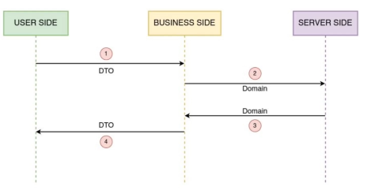

# Application Development

Based on the knowledge we aquired in [[01 Router Basics]] we will be structuring our application and focus on our banking application.

## The Hexagonal Architecture

This is also know as *Ports & Adapters*, this is a pattern which guides the structuring of our application and manages our dependencies.

- This arquitecture host the *Domain Logic* in the center.
- It issolates the core bussiness of an application, so it's behavior can be tested independently.
- Not complicated to set up.


### Principles
Built on 3 principles
- Explicitly separate the code in 3 large areas.
	- **The User Side or the left side:** Responsible for driving our application, through this side the users will intereact with the application. Eg. The user interface or the http routes.
	- **The Bussiness Side or the Center - Logic:** This is where we issolate from the left and right.
	- **Server Side or the right side:** It contains the essential infraestructure details like the code which interacts with the data base, mocks and call to the system or external web services.	

	With this separation we are separating problems
- The dependencies must go inside, this means each side must depend on the bussiness logic.
- The boundaries are issolates within the interfaces, ports are allow the adapters to communicate with the application.

This is how the Hexagonal architecture would look like in our application.


## Implementing the Hexagonal Architecture

We will be starting in the Bussiness Side domain in order to implement the Hexagonal Architecture. 

Let's create the bussiness object for retrieving a list of customers.

```go
// domain/customer.go

package domain

	// Create the bussiness object
	type Customer struct {
		Id string
		Name string
		City string
		Zipcode string
		DateofBirth string
		Status string

	}

	// Secondary Port
	type CustomerRepository interface {
	FindAll() (\[\]Customer, error)
}
```

Create a the Mock Adapter, which will contain dummy data.

```go
// domain/customerRepositoryStub.go

package domain

// Mock Adapter

// Contains a dummy list of Customers

type CustomerRepositoryStub struct {
	customers \[\]Customer
}

// FindAll function which implements the CustomerRepositoryStub

func (s CustomerRepositoryStub) FindAll() (\[\]Customer, error) {
	return s.customers, nil
}

// Helper function for creating a new list of customers and returns the customer repository stub

func NewCustomerRepositoryStub() CustomerRepositoryStub {
	customers := \[\]Customer{
		{Id: "1001", Name: "Jotaro Kujo", City: "Okinawa", Zipcode: "30205", DateofBirth: "1970-01-01", Status: "1"},
		{Id: "1001", Name: "Jonathan Joestar", City: "England", Zipcode: "95457", DateofBirth: "1868-04-04", Status: "0"},
		{Id: "1001", Name: "Joseph Joestar", City: "England", Zipcode: "95825", DateofBirth: "1920-09-27", Status: "1"},
	}
	return CustomerRepositoryStub{customers}
}
```

With this code we have created the bussiness object and the mock adapter in our application.


Now we need to connect the Service and the Repository, to accomplish this, we will create the bussiness logic component which implements the service and inject the dependency from the repository.

```go
// service/customerService.go

package service

import "banking/domain"

// CustomerService : Primary Port
type CustomerService interface {
	GetAllCustomer() (\[\]domain.Customer, error)
}
  
// DefaultCustomerService : Named Default because the could be more implementations

type DefaultCustomerService struct {
	// Has a dependency on the CustomerRepository
	repo domain.CustomerRepository
}

// GetAllCustomer : Helper function which returns the Customer repository's FindAll() function
func (s DefaultCustomerService) GetAllCustomer() (\[\]domain.Customer, error) {
	return s.repo.FindAll()
}

// NewCustomerService : Return a new DefaultCustomerService which takes a CustomerRepository.
func NewCustomerService(repository domain.CustomerRepository) DefaultCustomerService {
	return DefaultCustomerService{repository}
}
```

With this code we are able to acomplish this.


Next we will connect our handlers with the customer service, this is done with a new `struct` which dependes on the `CustomerService` interface

```go
type CustomerHandlers struct {
	service service.CustomerService
}

func (ch \*CustomerHandlers) getAllCustomers(w http.ResponseWriter, r \*http.Request) {

}
```

With this, we are able to connect the handlers and the service.


Finally we need to wire up our whole application at `app.go`.

```go
func Start() {
	// wiring
	ch := CustomerHandlers{service.NewCustomerService(domain.NewCustomerRepositoryStub())}
}
```

This is how our application looks like now


In the handler we are able to retrieve our customer list like so

```go
func (ch \*CustomerHandlers) getAllCustomers(w http.ResponseWriter, r \*http.Request) {
	customers, _ := ch.service.GetAllCustomer()
}
```

## DataBase Adapter

Now we need to implement the DataBase Adapter into our application and finally inject it when working with our application. For this we will need a real MySql database instance.


To access our database we will need Go's [MySql driver](https://github.com/Go-SQL-Driver/MySQL/) which will allow us to open a connection and query into a MySql instance.

First let's implement the `CustomerRepository`'s interface through the `FindAll()` method.

```go
// FindAll : Queries the database for the list of customers.

func (d CustomerRepositoryDb) FindAll() (\[\]Customer, error) {

  

	// Create the query

	findAllSQL := "SELECT customer\_id, name, city, zipcode, date\_of\_birth, status FROM customers;"

	// Execute the query

	rows, err := d.client.Query(findAllSQL)


	if err != nil {

		log.Println("Error while querying customer table" + err.Error())

	return nil, err

	}

	// Create a Customers slice

	customers := make(\[\]Customer, 0)

	// For each row

	for rows.Next() {

		// Create a new customer

		var c Customer

		err := rows.Scan(&c.ID, &c.Name, &c.City, &c.Zipcode, &c.DateofBirth, &c.Status)

	if err != nil {

		log.Println("Error while scanning customer" + err.Error())

		return nil, err

	}

	// Append the created customer into the customers slice

	customers \= append(customers, c)

	}

	// Return the customers slice with nil as error

	return customers, nil

}
```

Our "constructor" function which returns a the `CustomerRepositoryDb` and create a sql client.

```go
// NewCustomerRepositoryDb : Creates a sql client and returns the CustomerRepositoryDB
func NewCustomerRepositoryDb() CustomerRepositoryDb {
	// Create a database client

	client, err := sql.Open("mysql", "root:root@tcp(localhost:3306)/banking")

	if err != nil {

		panic(err)

	}

	// See "Important settings" section.

	client.SetConnMaxLifetime(time.Minute \* 3)

	client.SetMaxOpenConns(10)

	client.SetMaxIdleConns(10)


	return CustomerRepositoryDb{client}
}
```

And the struct.

```go
// CustomerRepositoryDb : Repository for querying the database

type CustomerRepositoryDb struct {
	client \*sql.DB
}
```

We can finally swap out our adapter at `App.go`

```go
func Start() {
	// wiring
	ch := CustomerHandlers{service.NewCustomerService(domain.NewCustomerRepositoryDb())}
}
```

## Error Handling Part 1

We'll implement a `ById` function to retrieve a single customer by his `customer_id`, first we'll add this function into our domain interface.

```go
// CustomerRepository : Secondary Port, boundary of the domain

type CustomerRepository interface {

	FindAll() (\[\]Customer, error)

	ById(string) (\*Customer, error)

}
```

In our `CustomerRepositoryDb` we need to implement this function, this is done very similar to the previous `FindAll()` function.

```go
// ById : Returns a single customer by his id.

func (d CustomerRepositoryDb) ById(id string) (\*Customer, error) {

	// Create the query

	customerSQL := "SELECT customer\_id, name, city, zipcode, date\_of\_birth, status FROM customers WHERE customer\_id = ?;"

	// id will replace the ? in the customerSQL string

	row := d.client.QueryRow(customerSQL, id)

	var c Customer

	err := row.Scan(&c.ID, &c.Name, &c.City, &c.Zipcode, &c.DateofBirth, &c.Status)

	if err != nil {

		log.Println("Error while scanning customer " + err.Error())

	return nil, err

	}

	return &c, nil

}
```

Add this new endpoint into our app.

```go
router.HandleFunc("/customers/{customer\_id:\[0-9\]+}", ch.getCustomer).Methods(http.MethodGet)
```

In our handler we will manage the thrown errors and the header response.

```go
func (ch \*CustomerHandlers) getCustomer(w http.ResponseWriter, r \*http.Request) {

	vars := mux.Vars(r)

	id := vars\["customer\_id"\]

	customer, err := ch.service.GetCustomer(id)

	if err != nil {

		// Add a not 404 NOT FOUND header response.

		w.WriteHeader(http.StatusNotFound)

		// Print the error

		fmt.Fprint(w, err.Error())

	} else {

	// Return a json response

		w.Header().Add("Content-Type", "application/json")

		json.NewEncoder(w).Encode(customer)

	}

}
```

## Error Handling Part 2

We have some aditional requirement in our error handling, we want to return a 500 (Internal Server Error) in case some unexpected error occurs like our database going down.

We can use our own errors package in order to throw errors specific for each use case.

```go
package errs
import "net/http"

type AppError struct {
	Code int
	Message string
}

// NewNotFoundError : Returns a not found error message
func NewNotFoundError(message string) \*AppError {
	return &AppError{
		Message: message,
		Code: http.StatusNotFound,
	}
}

// NewUnexpectedError : Returns a Internal Server Error
func NewUnexpectedError(message string) \*AppError {
	return &AppError{
	Message: message,
	Code: http.StatusInternalServerError,

	}
}
```

We can now return this custom errors in our functions

```go
// ById : Returns a single customer by his id.

func (d CustomerRepositoryDb) ById(id string) (\*Customer, \*errs.AppError) {

	if err != nil {
	// If no customer is found at all
		if err \== sql.ErrNoRows {
			return nil, errs.NewNotFoundError("Customer not found")

		} else {
			log.Println("Error while scanning customer " + err.Error())
			return nil, errs.NewUnexpectedError("Unexpected database error")
		}
	}
	return &c, nil
}
```

With this change we need to update each interface to return `errs.AppError`.

```go
// CustomerRepository : Secondary Port, boundary of the domain
type CustomerRepository interface {
	FindAll() ([]Customer, error)
	ById(string) (*Customer, *errs.AppError)
}
```

## Refactor Error Handling

First let's return the error messages in `json` format.

```go
// handlers.go
func (ch \*CustomerHandlers) getCustomer(w http.ResponseWriter, r \*http.Request) {
	customer, err := ch.service.GetCustomer(id)
	if err != nil {
		// Do always use this order
		w.Header().Add("Content-Type", "application/json")
		w.WriteHeader(err.Code)
		json.NewEncoder(w).Encode(err)
	} else {
		// Return a json response
		w.Header().Add("Content-Type", "application/json")
		json.NewEncoder(w).Encode(customer)
	}
}
```

We are duplicating our error messages, since we are returning the error code inside our `json` response. We will create a function to return the error message and ommit the error code property when it is empty.

```go
type AppError struct {
	Code int `json:",omitempty"`
	Message string
}
func (e AppError) AsMessage() *AppError {
	return &AppError{
	Message: e.Message,
	}
}
```

Let's create a function for writing the json response and avoid repeating ourselves

```go
func (ch \*CustomerHandlers) getCustomer(w http.ResponseWriter, r \*http.Request) {
	vars := mux.Vars(r)
	id := vars\["customer_id"]
	customer, err := ch.service.GetCustomer(id)
	if err != nil {
		writeResponse(w, err.Code, err.AsMessage())
	} else {
		writeResponse(w, http.StatusOK, customer)
	}
}

// writeResponse : Function for writting a json response
func writeResponse(w http.ResponseWriter, code int, data interface{}) {
	w.Header().Add("Content-Type", "application/json")
	w.WriteHeader(code)
	err := json.NewEncoder(w).Encode(data)
	if err != nil {
		panic(err)
	}
}
```

## Structured Logging

Loggin can be done with [zap](https://github.com/uber-go/zap) to allow us to generate loggs in a structured manner.

Let's configure a logg configuration to return timestamps with a new key and another format.

```go
var log *zap.Logger

func init() {
	var err error
	config := zap.NewProductionConfig()

	encoderConfig := zap.NewProductionEncoderConfig()
	encoderConfig.TimeKey \= "timestamp"
	encoderConfig.EncodeTime \= zapcore.ISO8601TimeEncoder
	config.EncoderConfig \= encoderConfig

	log, err = config.Build(zap.AddCallerSkip(1))

	if err != nil {
		panic(err)
	}
}
```

And create a few helper function to not expose zap, this will allow us to migrate into another logging package if needed in the future.

```go
// Info : Log out a information message
func Info(message string, fields ...zap.Field) {
	log.Info(message, fields...)
}

// Debug : Log out a debug message
func Debug(message string, fields ...zap.Field) {
	log.Debug(message, fields...)
}

// Error : Log out a error message
func Error(message string, fields ...zap.Field) {
	log.Info(message, fields...)
}
```

## SQLX

[SQLX](https://github.com/jmoiron/sqlx) is a library which provides a set of extensions on the regular sql driver, it wil allow us to reduce the ammount of boiler plate code in our application.

SQLX will use our domain object in order to retrieve data from the database but we need to match this object's property names with those located at the table schema.

```go
// CustomerRepositoryDb : Repository for querying the database
type CustomerRepositoryDb struct {
	client *sqlx.DB
}

type Customer struct {
	ID string `db:"customer_id"`
	Name string
	City string
	Zipcode string
	DateofBirth string `db: "date_of_birth"`
	Status string
}
```


Configure the customer repository to use sqlx.

```go
// NewCustomerRepositoryDb : Creates a sql client and returns the CustomerRepositoryDB
func NewCustomerRepositoryDb() CustomerRepositoryDb {
// Create a database client
	client, err := sqlx.Open("mysql", "root:root@tcp(localhost:3306)/banking")
return CustomerRepositoryDb{client}
}
```

We can now use SQLX's helper function.

```go
// FindAll : Queries the database for the list of customers.
func (d CustomerRepositoryDb) FindAll(status string) (\[]Customer, *errs.AppError) {
	var err error
	var findAllSQL string
	// Create a Customers slice
	customers := make(\[\]Customer, 0)
	if status != "" {
		findAllSQL = "SELECT customer\_id, name, city, zipcode, date_of_birth, status FROM customers WHERE status=?;"
		err \= d.client.Select(&customers, findAllSQL, status)
	} else {
		findAllSQL = "SELECT customer\_id, name, city, zipcode, date_of_birth, status FROM customers;"
		err \= d.client.Select(&customers, findAllSQL)
	}
	if err != nil {
		logger.Error("Error while querying customer table " + err.Error())
		return nil, errs.NewUnexpectedError("Error while querying customer table " + err.Error())
	}
	return customers, nil
}

// ById : Returns a single customer by his id.
func (d CustomerRepositoryDb) ById(id string) (\*Customer, \*errs.AppError) {
	// Create the query
	customerSQL := "SELECT customer\_id, name, city, zipcode, date\_of\_birth, status FROM customers WHERE customer\_id = ?;"
	var c Customer
	err := d.client.Get(&c, customerSQL, id)
	if err != nil {
		// If no customer is found at all
		if err \== sql.ErrNoRows {
			return nil, errs.NewNotFoundError("Customer not found")
		} else {
			logger.Error("Error while scanning customer " + err.Error())
			return nil, errs.NewUnexpectedError("Unexpected database error")
		}
	}
	return &c, nil
}
```

## Data Transfer Object

This special layer is meant for communication between the user side with the bussiness side.



This layer improves modularity and prevents domain object scattering around all the other layers, until now we have been using the domain objects as DTO's, this is fine for small applications but the domain should not be exposed to the outside world.

First create a `CustomerResponse.go` inside a `dto` package.

```go
// CustomerResponse : DTO for the customer json response

type CustomerResponse struct {
	ID string `json:"customer_id"`
	Name string `json:"full_name"`
	City string `json:"city"`
	Zipcode string `json:"zipcode"`
	DateofBirth string `json:"date_of_birth"`
	Status string `json:"status"`
}
```

In our customer domain object we will be creating a function to return a customer DTO.

```go
// ToDTO : Returns a customer domain object as a DTO customer object
func (c Customer) ToDTO() dto.CustomerResponse {
	return dto.CustomerResponse{
		ID: c.ID,
		Name: c.Name,
		City: c.City,
		Zipcode: c.Zipcode,
		DateofBirth: c.DateofBirth,
		Status: c.AsStatusText(),
	}
}

// AsStatusText : Return the number for status as a new string
func (c Customer) AsStatusText() string {
	statusText := "Active"
	if c.Status \== "0" {
	statusText \= "Inactive"
	}
	return statusText
}
```

In the customer service alter the function to return the customer dto.

```go
// GetCustomer : Helper function which returns a customer DTO
func (s DefaultCustomerService) GetCustomer(id string) (\*dto.CustomerResponse, \*errs.AppError) {
	c, err := s.repo.ById(id)
	if err != nil {
		return nil, err
	}
	response := c.ToDTO()
	return &response, nil
}
```

## Application Configuration

To remove our hardcoded configuration we will be setting up enviroment variables. In this course enviroment variables have been set up injecting them directly from the command line but I decided to look for a way to import them fron a external `.env` file. 

To accomplish this I used [godotenv](https://github.com/joho/godotenv) which can easily load a `.env` file located at the root of the project. 
This is a example `.env` file which was used in this project.
```
DB_USER=
DB_PASSWORD\=
DB_ADDRESS\=
DB_PORT\=
DB_NAME\=
```

Load the variables using `godotenv.Load()`, also a "sanity check" is done

```go
func checkVariables() {
	dbUser := os.Getenv("DB_USER")
	dbPassword := os.Getenv("DB_PASSWORD")
	dbAddress := os.Getenv("DB_ADDRESS")
	dbPort := os.Getenv("DB_PORT")
	dbName := os.Getenv("DB_NAME")
	if dbUser == "" ||
		dbPassword == "" ||
		dbAddress == "" ||
		dbPort == "" ||
		dbName == "" {
		log.Fatal("Envoriment variables not defined...")
	}
}

func Start() {
	// Load env variables
	err := godotenv.Load()
	if err != nil {
		panic("Error loading .env file")
	}
	checkVariables()
}
```

Now just import this variables at our db connection configuration.

```go
// NewCustomerRepositoryDb : Creates a sql client and returns the CustomerRepositoryDB
func NewCustomerRepositoryDb() CustomerRepositoryDb {

	dbUser := os.Getenv("DB_USER")
	dbPassword := os.Getenv("DB_PASSWORD")
	dbAddress := os.Getenv("DB_ADDRESS")
	dbPort := os.Getenv("DB_PORT")
	dbName := os.Getenv("DB_NAME")

	dataSource := fmt.Sprintf("%s:%s@tcp(%s:%s)/%s", dbUser, dbPassword, dbAddress, dbPort, dbName)

	// Create a database client
	client, err := sqlx.Open("mysql", dataSource)
	if err != nil {
		panic(err)
	}

	return CustomerRepositoryDb{client}
}
```

## New Bank Account

Let's create a new endpoint for a user account, create a new domain object.

```go
type Account struct {
	AccountId   string
	CustomerId  string
	OpeningDate string
	AccountType string
	Amount      float64
	status      string
}

type AccountRepository interface {
	Save(Account) (*Account, *errs.AppError)
}
```

Create the database adapter in the server side, since we are introducing a new db adapter we will move our logic for stablishing a connection with the database into our `app.go`, for now this is how the `accountRepositoryDB` should look like.

```go

type AccountRepositoryDB struct {
	client *sqlx.DB
}

// Save : Take a customer and create a new account record
func (d AccountRepositoryDB) Save(a Account) (*Account, *errs.AppError) {
	sqlInsert := "INSERT INTO accounts (customer_id, opening_date, account_type, amount, statys) VALUES(?, ?, ?, ?, ?);"
	result, err := d.client.Exec(sqlInsert, a.CustomerId, a.OpeningDate, a.AccountType, a.Amount, a.status)
	if err != nil {
		logger.Error("Error while creating new account: " + err.Error())
		return nil, errs.NewUnexpectedError("Unexpected error from database")
	}
	// Returns the id
	id, err := result.LastInsertId()

	if err != nil {
		logger.Error("Error while retrieving last inserted id: " + err.Error())
		return nil, errs.NewUnexpectedError("Unexpected error from database")
	}
	// Save the account id into the domain object
	a.AccountId = strconv.FormatInt(id, 10)
	return &a, nil
}

// NewAccountRepositoryDB : Returns the account repository
func NewAccountRepositoryDB(dbClient *sqlx.DB) AccountRepositoryDB {
	return AccountRepositoryDB{dbClient}
}
```

Do notice how `NewAccountRepositoryDB` takes a `sqlx.DB` intance, apply this exact change in the `NewUserRepositoryDB` function.

```go
// NewCustomerRepositoryDb : Creates a sql client and returns the CustomerRepositoryDB
func NewCustomerRepositoryDb(dbClient *sqlx.DB) CustomerRepositoryDb {
	return CustomerRepositoryDb{dbClient}
}
```

We will move the db logic into `app.go`

```go
func getDBClient() *sqlx.DB {
	dbUser := os.Getenv("DB_USER")
	dbPassword := os.Getenv("DB_PASSWORD")
	dbAddress := os.Getenv("DB_ADDRESS")
	dbPort := os.Getenv("DB_PORT")
	dbName := os.Getenv("DB_NAME")

	dataSource := fmt.Sprintf("%s:%s@tcp(%s:%s)/%s", dbUser, dbPassword, dbAddress, dbPort, dbName)

	// Create a database client
	client, err := sqlx.Open("mysql", dataSource)
	if err != nil {
		panic(err)
	}
	// See "Important settings" section.
	client.SetConnMaxLifetime(time.Minute * 3)
	client.SetMaxOpenConns(10)
	client.SetMaxIdleConns(10)
	return client
}
```

And when creating these adapters we can simply pass it as a param.

```go
func Start() {
	// wiring
	dbClient := getDBClient()
	customerRepositoryDB := domain.NewCustomerRepositoryDb(dbClient)
	// accountRepositoryDB := domain.NewAccountRepositoryDB(dbClient)
	ch := CustomerHandlers{service.NewCustomerService(customerRepositoryDB)}
}
```

## New Bank Account 2

Let's create the primary port for this API, create the DTO objects needed the response must only returns the `account_id` and the response has fewer properties.

```go
// dto/newAccountRequest.go
type NewAccountRequest struct {
	CustomerId  string  `json:"customer_id"`
	AccountType string  `json:"account_type"`
	Amount      float64 `json:"amount"`
}

// Validate : Validates the dto account request with the bussiness rules
func (r NewAccountRequest) Validate() *errs.AppError {
	if r.Amount < 5000 {
		return errs.NewValidationError("To open a new account you need to deposit atleast 5000.00")
	}
	if strings.ToLower(r.AccountType) != "savings" && strings.ToLower(r.AccountType) != "checking" {
		return errs.NewValidationError("Account type should be checking or savings.")
	}
	return nil
}
```

```go
// dto/newAccountResponse.go
type NewAccountResponse struct {
	AccountId string `json:account_id`
}
```

Now we can create the account service.

```go
// service/accountService.go
type AccountService interface {
	NewAccount(dto.NewAccountRequest) (*dto.NewAccountResponse, *errs.AppError)
}

type DefaultAccountService struct {
	repo domain.AccountRepository
}

// NewAccount : Create a new account and returns a account response dto.
func (s DefaultAccountService) NewAccount(req dto.NewAccountRequest) (*dto.NewAccountResponse, *errs.AppError) {
	// Validate the request
	err := req.Validate()

	if err != nil {
		return nil, err
	}

	a := domain.Account{
		AccountId:   "",
		CustomerId:  req.CustomerId,
		OpeningDate: time.Now().Format("2006-01-02T15:04:05"),
		AccountType: req.AccountType,
		Amount:      req.Amount,
		Status:      "1",
	}
	newAccount, err := s.repo.Save(a)
	if err != nil {
		return nil, err
	}
	response := newAccount.ToNewAccountResponseDTO()
	return &response, nil
}

func NewAccountService(repo domain.AccountRepository) DefaultAccountService {
	return DefaultAccountService{repo}
}
```

Set up the handler

```go
// app/accountHandlers.go
type AccountHandler struct {
	service service.AccountService
}

func (h AccountHandler) newAccount(w http.ResponseWriter, r *http.Request) {

	vars := mux.Vars(r)
	customerId := vars["customer_id"]

	var request dto.NewAccountRequest
	// Decode the request into the "request" variable
	err := json.NewDecoder(r.Body).Decode(&request)
	// Check for errors in the decoding, BAD REQUEST
	if err != nil {
		writeResponse(w, http.StatusBadRequest, err.Error())
	} else {
		request.CustomerId = customerId
		// Create a new account by accesing the service
		account, appError := h.service.NewAccount(request)
		if appError != nil {
			// Write into the response if a error is found
			writeResponse(w, appError.Code, appError.Message)
		} else {
			// Write into the response the dto
			writeResponse(w, http.StatusCreated, account)
		}

	}
}
```

And wire this up

```go
// app/app.go
func Start() {
	// wiring
	dbClient := getDBClient()
	accountRepositoryDB := domain.NewAccountRepositoryDB(dbClient)
	ah := AccountHandler{service.NewAccountService(accountRepositoryDB)}
	
	router.HandleFunc("/customers/{customer_id:[0-9]+}/account", ah.newAccount).Methods(http.MethodPost)
}
```